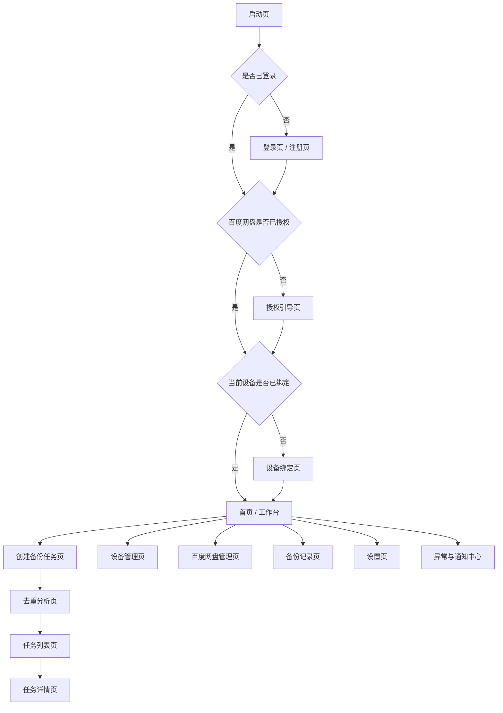
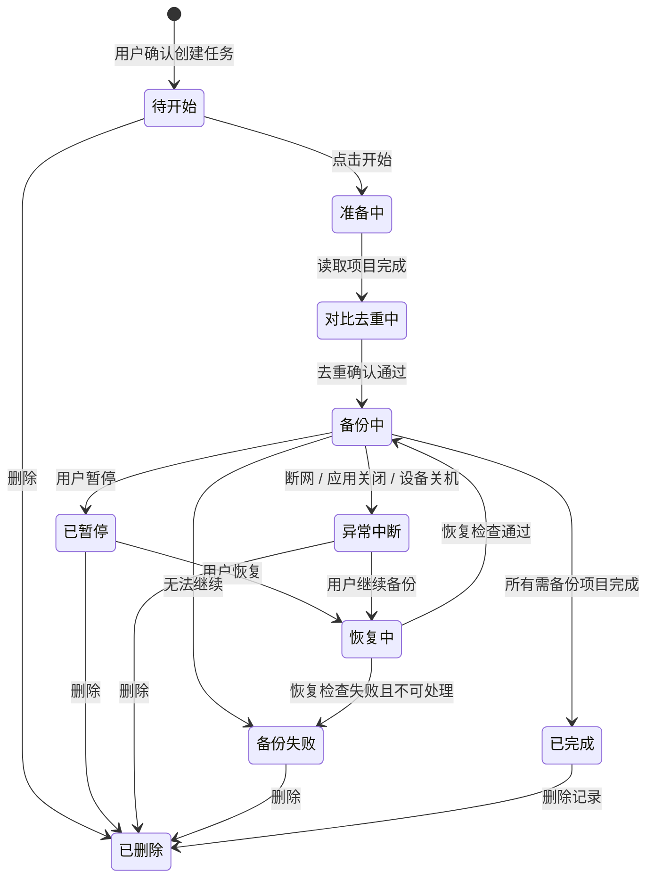
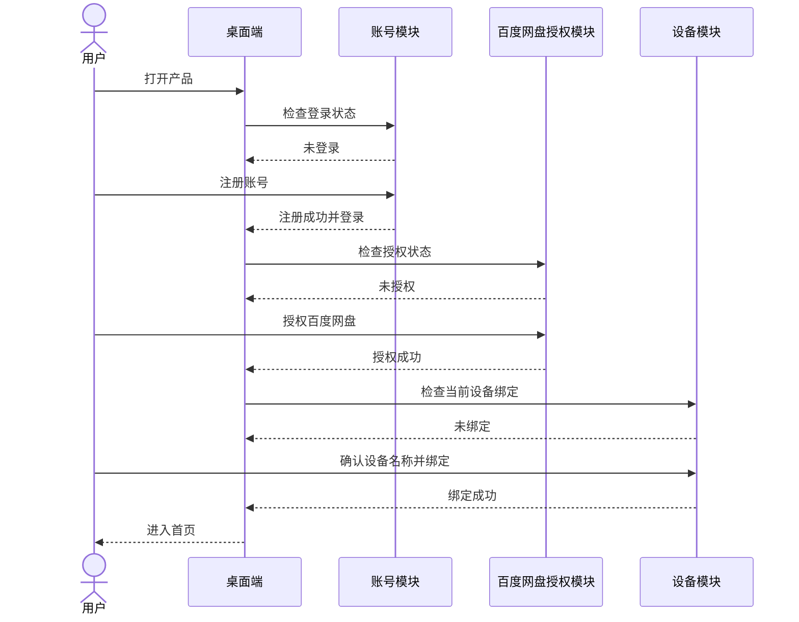
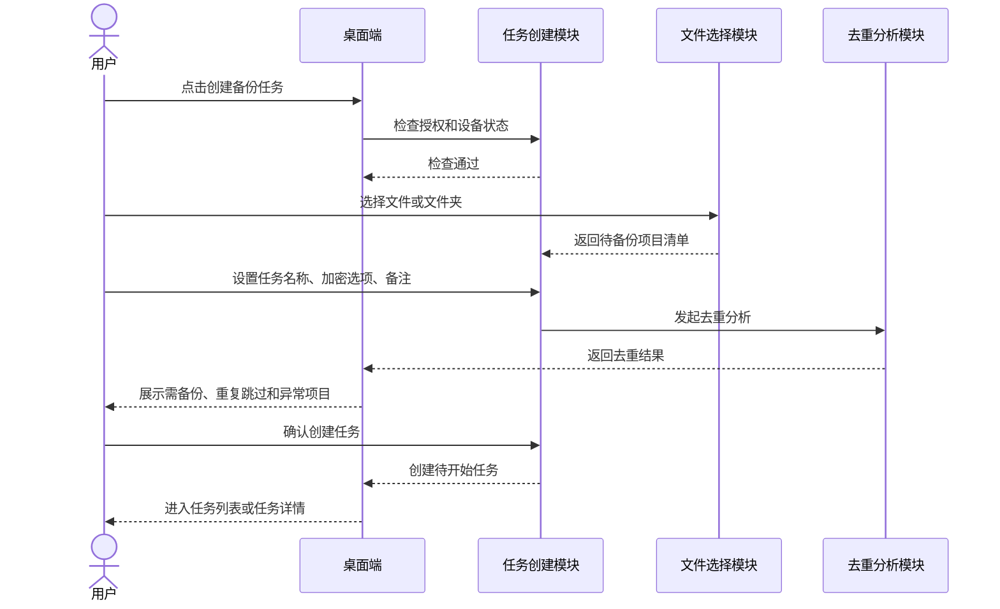
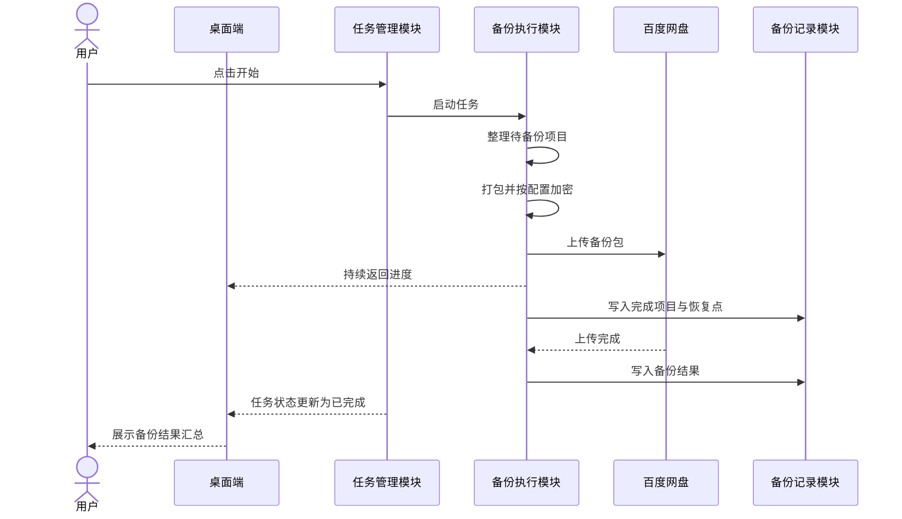
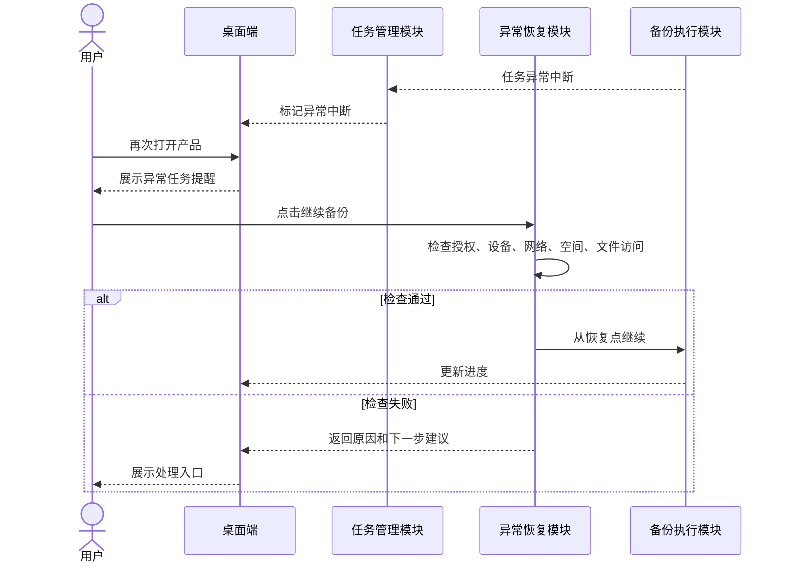

# Baidu Dedupe Backup Design

## 1. 文档目的

本文档基于 `多设备去重备份项目PRD.md` 和 `docs/spec.md`，描述 Baidu Dedupe Backup 首期产品的系统边界、模块划分、核心数据对象、关键流程和体验设计原则。

本文档用于指导后续原型设计、技术方案拆解、接口设计、数据建模和研发任务拆分。本文档不指定具体编程语言、框架、数据库、加密算法或文件识别算法。

## 2. 设计目标

1. 支撑桌面端优先的多设备备份体验。
2. 将账号、设备、任务、备份记录和百度网盘授权统一到同一用户维度下。
3. 让备份任务具备可暂停、可恢复、可解释的状态流转。
4. 让多设备去重结果在正式备份前对用户透明。
5. 对高风险操作提供明确确认和可理解的影响说明。
6. 为后续移动端、网页管理端或更多云盘扩展保留清晰边界。

## 3. 设计假设

1. 首期以桌面端为主要使用端。
2. 首期只支持百度网盘作为备份存储目标。
3. 首期需要账号体系，所有设备、任务和记录都归属于用户账号。
4. 首期默认开启加密备份，允许用户在创建任务时关闭加密。
5. 首期默认开启去重备份，不提供复杂技术参数配置。
6. 首期不包含备份恢复到本地、定时自动备份和跨账号迁移。

## 4. 系统边界

### 4.1 系统内职责

- 用户账号注册、登录、退出登录和登录状态管理。
- 百度网盘授权状态管理。
- 当前设备识别、绑定和设备列表管理。
- 文件或文件夹选择结果读取。
- 备份任务创建、状态管理和操作控制。
- 备份前去重分析与结果展示。
- 打包、加密、上传和进度跟踪的任务编排。
- 异常中断记录与恢复入口。
- 备份记录与历史查询。
- 面向用户的风险提示、错误提示和通知。

### 4.2 系统外依赖

- 百度网盘授权服务。
- 百度网盘文件上传与空间查询能力。
- 操作系统文件选择、文件读取和设备信息能力。
- 网络连接状态。
- 本地持久化能力，用于保存任务恢复所需状态。
- 服务端持久化能力，用于保存账号、设备、任务、备份记录和去重索引。

## 5. 产品信息架构

## 6. 模块设计

### 6.1 账号模块

**职责**：

- 注册、登录、退出登录。
- 维护登录态。
- 提供忘记密码或重置密码入口。
- 控制未登录用户访问受保护页面。

**关键规则**：

- 注册成功后默认自动登录。
- 登录异常必须给出明确原因。
- 退出登录不影响已完成任务和历史记录。

### 6.2 百度网盘授权模块

**职责**：

- 发起百度网盘授权。
- 展示授权账号、授权状态、最近授权时间和空间概况。
- 处理授权失效、授权异常和重新授权。
- 支持用户解除绑定。

**关键规则**：

- 未授权不能创建或开始备份任务。
- 授权失效后，任务不能继续，用户需要重新授权。
- 解除绑定前必须二次确认。
- 解除绑定后，未完成任务进入不可继续状态，直到重新授权。

### 6.3 设备模块

**职责**：

- 识别当前设备。
- 引导用户绑定当前设备。
- 管理设备列表、设备状态、设备名称和设备备份概况。
- 支持查看某台设备下的任务。
- 支持解绑设备。

**关键规则**：

- 当前设备未绑定时不能创建或执行备份任务。
- 当前设备必须在设备列表中明确标识。
- 解绑设备不删除历史备份记录和百度网盘文件。

### 6.4 文件选择模块

**职责**：

- 调用系统文件或文件夹选择能力。
- 读取用户选择的项目基础信息。
- 校验项目是否存在、是否可访问。
- 生成待备份项目清单。

**关键规则**：

- 支持多文件、多文件夹和混合选择。
- 用户可移除已选择项目，也可继续添加项目。
- 文件不可访问时，需要在进入去重分析前提示用户处理。

### 6.5 任务创建模块

**职责**：

- 收集任务名称、备份内容、加密选项、备注等设置。
- 自动生成默认任务名称。
- 校验授权、设备、文件选择和网盘空间状态。
- 管理创建流程从选择内容到去重确认再到生成任务。

**关键规则**：

- 加密默认开启。
- 去重默认开启。
- 关闭加密必须二次确认。
- 用户确认去重结果后，任务才进入任务列表。

### 6.6 去重分析模块

**职责**：

- 将本次待备份项目与当前账号下历史备份项目进行对比。
- 生成需备份、已备份、重复跳过、异常待确认四类结果。
- 统计预计节省空间。
- 解释重复来源设备和历史任务。

**关键规则**：

- 去重范围覆盖当前账号下已绑定和曾绑定设备。
- 同一设备历史备份也参与去重。
- 页面只展示用户能理解的结果，不展示复杂算法细节。
- 异常待确认项目需要允许用户跳过或返回处理。

### 6.7 备份执行模块

**职责**：

- 按任务配置整理待备份内容。
- 执行打包与加密。
- 上传到百度网盘。
- 上报进度、速度、当前处理项目和结果。
- 写入可恢复的任务进度。

**关键规则**：

- 已判定重复跳过的项目不进入实际备份。
- 任务开始后，加密设置不可随意变更。
- 任务执行过程需要持续记录恢复点。
- 已完成项目在恢复时不重复处理。

### 6.8 任务管理模块

**职责**：

- 展示任务列表和任务详情。
- 管理开始、暂停、恢复、继续备份、删除等操作。
- 管理任务状态流转。
- 展示进度、异常和结果汇总。

**关键规则**：

- 异常中断任务必须保留在列表中。
- 正在备份的任务删除前需要暂停或二次确认。
- 删除任务记录不默认删除百度网盘备份文件。

### 6.9 异常恢复模块

**职责**：

- 识别网络异常、应用关闭、设备关机、授权失效、空间不足、文件不可访问等异常。
- 将任务转入对应异常状态。
- 提供用户可见恢复入口。
- 恢复前执行必要检查。
- 提示不可恢复原因和下一步建议。

**关键规则**：

- 用户再次进入产品后能看到异常任务提醒。
- 恢复前检查授权、设备、网络、空间和文件可访问状态。
- 恢复时已完成项目不重复处理。

### 6.10 备份记录模块

**职责**：

- 保存历史备份任务和结果。
- 支持按设备、状态、时间、加密状态和关键词筛选。
- 支持从历史记录进入任务详情。

**关键规则**：

- 解绑设备后，相关历史记录仍可查看。
- 删除任务记录不应默认删除历史备份结果中的云盘文件说明。

### 6.11 通知模块

**职责**：

- 集中展示需要用户处理的问题。
- 将通知关联到任务、授权、设备或设置页面。
- 支持已处理自动标记和手动清除。

**通知类型**：

- 备份完成。
- 任务暂停。
- 任务异常中断。
- 百度网盘授权失效。
- 百度网盘空间不足。
- 文件不可访问。
- 设备绑定异常。

## 7. 核心数据对象

### 7.1 User 用户

- 用户 ID。
- 手机号或邮箱。
- 登录状态。
- 账号状态。
- 创建时间。
- 最近登录时间。

### 7.2 CloudAuthorization 云盘授权

- 授权 ID。
- 用户 ID。
- 云盘类型，首期固定为百度网盘。
- 百度网盘账号昵称。
- 授权状态。
- 最近授权时间。
- 授权失效时间。
- 空间总量。
- 空间已用量。

### 7.3 Device 设备

- 设备 ID。
- 用户 ID。
- 设备名称。
- 设备类型。
- 是否当前设备。
- 设备状态。
- 首次绑定时间。
- 最近在线时间。
- 最近备份时间。
- 是否已解绑。

### 7.4 BackupTask 备份任务

- 任务 ID。
- 用户 ID。
- 设备 ID。
- 任务名称。
- 任务备注。
- 任务状态。
- 是否加密。
- 是否开启去重。
- 创建时间。
- 开始时间。
- 完成时间。
- 百度网盘保存位置。
- 总项目数。
- 需备份项目数。
- 重复跳过项目数。
- 异常项目数。
- 已完成项目数。
- 已节省空间。

### 7.5 BackupItem 备份项目

- 项目 ID。
- 任务 ID。
- 原始路径。
- 项目名称。
- 项目类型，文件或文件夹。
- 项目大小。
- 项目状态。
- 是否重复。
- 重复来源设备 ID。
- 重复来源任务 ID。
- 异常原因。

### 7.6 DedupeResult 去重结果

- 去重结果 ID。
- 任务 ID。
- 总项目数。
- 需备份项目数。
- 已备份项目数。
- 重复跳过项目数。
- 异常待确认项目数。
- 预计节省空间。
- 分析时间。

### 7.7 BackupRecord 备份记录

- 记录 ID。
- 用户 ID。
- 设备 ID。
- 任务 ID。
- 完成状态。
- 是否加密。
- 创建时间。
- 完成时间。
- 备份内容概况。
- 去重结果摘要。
- 百度网盘保存位置。

### 7.8 Notification 通知

- 通知 ID。
- 用户 ID。
- 关联任务 ID。
- 关联设备 ID。
- 通知类型。
- 通知标题。
- 通知内容。
- 是否已处理。
- 创建时间。

## 8. 任务状态设计

## 9. 核心流程设计

### 9.1 首次使用流程

### 9.2 创建备份任务流程

### 9.3 备份执行流程

### 9.4 异常恢复流程

## 10. 去重结果体验设计

### 10.1 页面表达

去重分析页应优先回答用户的三个问题：

1. 我这次选了多少内容？
2. 实际会备份多少内容？
3. 哪些内容因为已经备份过会被跳过？

### 10.2 推荐展示结构

- 顶部摘要：总项目数、需备份数量、重复跳过数量、异常待确认数量、预计节省空间。
- 需备份列表：展示本次会实际备份的项目。
- 重复跳过列表：展示重复项目，并标明来源设备和历史任务。
- 异常待确认列表：展示无法判断或无法访问的项目，并提供处理建议。
- 确认区：提供“返回修改”和“确认创建任务”。

### 10.3 推荐说明文案

分析完成。本次选择的项目中，有部分内容已在你的其他设备或历史任务中备份过，将自动跳过重复项目。

## 11. 安全与风险提示设计

### 11.1 关闭加密

**触发场景**：

- 创建任务时关闭加密。
- 设置页关闭默认加密偏好。

**确认文案**：

关闭加密后，备份内容将以未加密形式保存。请确认该任务不包含敏感资料。

**设计要求**：

- 确认按钮文案应明确，例如“确认关闭加密”。
- 取消按钮应优先保留安全默认值。

### 11.2 删除任务

**确认文案**：

删除后，该任务将不再显示在任务列表中。已完成上传到百度网盘的备份文件不会自动删除。

**设计要求**：

- 正在备份中的任务删除前，应先提示暂停或要求二次确认。
- 不默认提供删除云盘文件能力。

### 11.3 解绑设备

**确认重点**：

- 解绑后该设备再次使用需要重新绑定。
- 历史备份记录仍可查看。
- 百度网盘中的备份文件不会被删除。

### 11.4 解绑百度网盘

**确认重点**：

- 未完成任务将无法继续。
- 后续备份需要重新授权。
- 已完成备份文件不会因解除绑定自动删除。

## 12. 异常体验设计

### 12.1 异常提示结构

每个异常提示必须包含：

- 发生了什么。
- 为什么可能发生。
- 用户下一步可以做什么。
- 是否可以重试或继续。

### 12.2 重点异常处理

| 异常 | 状态变化 | 主要入口 | 用户下一步 |
| --- | --- | --- | --- |
| 网络异常 | 备份中 → 异常中断或已暂停 | 任务列表、通知中心 | 检查网络后继续 |
| 应用关闭 | 备份中 → 异常中断 | 启动后任务提醒 | 继续备份 |
| 设备关机 | 备份中 → 异常中断 | 重新打开后任务提醒 | 继续备份 |
| 授权失效 | 备份中 → 备份失败或异常中断 | 授权管理页、任务详情 | 重新授权 |
| 空间不足 | 备份中 → 已暂停或备份失败 | 任务详情、百度网盘管理页 | 清理空间后继续 |
| 文件不可访问 | 准备中或恢复中 → 异常待确认 | 去重分析页、任务详情 | 跳过或重新选择 |

## 13. 首页工作台设计

首页应承担“状态总览”和“下一步行动”两类职责。

### 13.1 状态总览

- 当前账号。
- 百度网盘授权状态。
- 当前设备绑定状态。
- 绑定设备数量。
- 总备份任务数。
- 已完成任务数。
- 进行中任务数。
- 异常中断任务数。
- 累计跳过重复项目数。
- 累计节省空间。

### 13.2 下一步行动

- 未授权：优先展示授权百度网盘。
- 当前设备未绑定：优先展示绑定当前设备。
- 有异常任务：优先展示继续备份。
- 无任务：优先展示创建备份任务。
- 状态正常：突出创建备份任务和最近任务。

## 14. 版本设计建议

### 14.1 V1.0 基础可用版

目标是让用户能完成从登录、授权、绑定设备到创建并完成备份任务的主路径。

包含：

- 注册登录。
- 百度网盘授权。
- 当前设备绑定。
- 文件或文件夹备份。
- 默认加密，可选不加密。
- 创建备份任务。
- 任务开始、暂停、恢复、删除。
- 任务进度查看。
- 基础异常恢复。

### 14.2 V1.1 多设备增强版

目标是强化多设备统一管理和去重解释能力。

包含：

- 多设备管理。
- 多设备去重结果展示。
- 按设备查看备份记录。
- 异常通知中心。
- 更完整的历史记录筛选。

### 14.3 V1.2 体验优化版

目标是优化长期使用体验。

包含：

- 更详细的节省空间统计。
- 更清晰的任务恢复引导。
- 批量任务管理。
- 默认备份偏好设置。
- 更完整的操作日志和用户提示。

## 15. 后续设计待确认

1. 首期端形态是否严格限定为桌面端。
2. 手机号和邮箱注册是否都在首期支持。
3. 单设备是否允许切换绑定不同账号。
4. 是否需要账号设备数量上限。
5. 是否在后续版本支持恢复到本地。
6. 删除任务时是否允许选择同步删除百度网盘文件。
7. 是否在后续版本支持定时自动备份。

