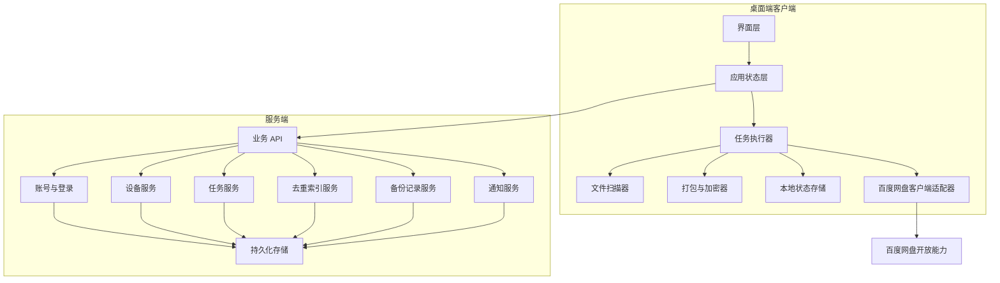

# 开发架构说明

## 1. 文档目的

本文档说明 Baidu Dedupe Backup 首期开发所需的系统架构、模块边界、运行时职责和工程拆分建议。它基于 `docs/spec.md` 和 `docs/design.md`，用于帮助研发在尚未选定具体技术栈前形成一致的实现边界。

## 2. 架构目标

1. 桌面端优先，保证文件选择、读取、打包、上传和任务恢复体验稳定。
2. 账号、设备、任务、备份记录和去重索引由服务端统一管理，支持多设备协同。
3. 本地客户端保留必要任务状态，保证断网、关机、应用关闭后可恢复。
4. 百度网盘能力通过独立适配层封装，避免业务逻辑直接依赖第三方 API。
5. 加密、去重、上传、恢复等高风险能力通过清晰模块隔离，便于测试和替换。

## 3. 推荐系统分层

## 4. 客户端职责

### 4.1 界面层

- 展示登录、授权、设备绑定、首页、任务创建、去重分析、任务列表、任务详情、设备管理、百度网盘管理、设置和通知中心。
- 按任务状态展示可用操作。
- 展示空状态、加载状态、错误状态和高影响操作确认。

### 4.2 应用状态层

- 管理登录态、当前用户、授权状态、当前设备状态。
- 缓存任务列表、任务详情和通知列表。
- 将用户操作转换为业务 API 或任务执行器调用。

### 4.3 任务执行器

- 管理本机正在执行的备份任务。
- 执行准备、扫描、去重确认后的实际备份、暂停、恢复和异常处理。
- 定期写入本地恢复点。
- 将任务进度上报给服务端。

### 4.4 文件扫描器

- 读取用户选择的文件或文件夹。
- 展开文件夹中的文件清单。
- 采集文件名、路径、大小、更新时间和可访问状态。
- 为去重索引提供文件识别所需的稳定元数据或内容摘要。
- 首期按 `dedupe-strategy.md` 生成源文件内容指纹，不以文件名或路径作为最终去重依据。

### 4.5 打包与加密器

- 根据任务配置生成备份包。
- 默认执行加密。
- 在用户关闭加密且完成风险确认后允许生成未加密备份包。
- 输出可上传的备份包和恢复点信息。
- 压缩后必须执行压缩包完整性测试和解包一致性校验，确认解出内容与源文件清单一致后才允许加密和上传。

### 4.6 本地状态存储

- 保存当前设备标识。
- 保存正在执行任务的恢复点。
- 保存上传进度和已完成项目标记。
- 不保存明文账号密码、百度网盘长期授权密钥或真实用户敏感数据。
- 管理任务临时工作区，记录压缩、解包校验、加密、上传阶段的中间产物状态，并在任务完成或删除后清理可清理文件。

### 4.7 百度网盘客户端适配器

- 封装授权回调处理、空间查询、上传、重试和错误转换。
- 将百度网盘错误转换为产品内统一错误码。
- 避免 UI 或任务执行器直接依赖第三方接口细节。

## 5. 服务端职责

### 5.1 业务 API

- 为客户端提供稳定的接口入口。
- 负责鉴权、参数校验、错误码转换和响应格式统一。
- 将请求分发给账号、设备、任务、去重、记录和通知服务。

### 5.2 账号与登录服务

- 处理注册、登录、退出登录、登录态校验。
- 管理账号状态。
- 支持忘记密码或重置密码入口。

### 5.3 设备服务

- 绑定当前设备。
- 管理设备名称、状态、最近在线时间、最近备份时间。
- 支持设备解绑和设备任务查询。

### 5.4 任务服务

- 创建任务。
- 管理任务状态流转。
- 保存任务配置、统计数据和进度。
- 校验任务操作是否符合当前状态。

### 5.5 去重索引服务

- 保存已完成备份项目的识别信息。
- 为新任务返回需备份、已备份、重复跳过和异常待确认结果。
- 支持按设备和历史任务追溯重复来源。
- 具体文件级内容指纹、索引写入、加密前指纹生成和异常判断规则见 `dedupe-strategy.md`。

### 5.6 备份记录服务

- 保存任务完成后的备份结果。
- 支持历史记录筛选和详情查询。
- 保留已解绑设备的历史记录关联。

### 5.7 通知服务

- 创建授权失效、空间不足、任务异常中断、备份完成等通知。
- 支持通知已处理和手动清除。

## 6. 模块边界

| 模块 | 可以依赖 | 不应依赖 |
| --- | --- | --- |
| UI | 应用状态层、统一错误模型 | 百度网盘原始 API、数据库 |
| 任务执行器 | 文件扫描器、打包与加密器、本地状态、云盘适配器、业务 API | 页面组件实现 |
| 文件扫描器 | 操作系统文件能力 | 账号服务、通知服务 |
| 打包与加密器 | 任务配置、文件清单 | UI 状态、第三方云盘 API |
| 云盘适配器 | 百度网盘开放能力、统一错误模型 | 页面组件、数据库结构 |
| 服务端任务服务 | 数据库、去重索引、记录服务、通知服务 | 客户端本地文件路径直接读取 |
| 去重索引服务 | 数据库、任务服务 | 桌面端 UI 细节 |

## 7. 关键运行时流程

### 7.1 应用启动

1. 客户端读取本地登录态和设备标识。
2. 客户端向服务端校验登录态。
3. 服务端返回用户、授权和设备摘要。
4. 客户端检查本地是否存在未完成任务恢复点。
5. 若存在异常任务，首页和通知中心展示恢复入口。

### 7.2 创建任务

1. 客户端校验用户已登录、百度网盘已授权、当前设备已绑定。
2. 用户选择文件或文件夹。
3. 文件扫描器生成项目清单。
4. 客户端提交项目摘要到服务端进行去重分析。
5. 服务端返回去重结果。
6. 用户确认后，服务端创建待开始任务。

### 7.3 执行任务

1. 用户点击开始。
2. 任务执行器读取任务配置和需备份项目。
3. 打包与加密器生成备份包。
4. 云盘适配器上传备份包到百度网盘。
5. 任务执行器持续写入本地恢复点并上报服务端进度。
6. 上传完成后，服务端写入备份记录和去重索引。

### 7.4 恢复任务

1. 用户点击继续备份。
2. 客户端读取本地恢复点。
3. 客户端向服务端校验任务仍可恢复。
4. 客户端检查文件可访问、授权有效、网盘空间可用。
5. 任务执行器跳过已完成项目，从恢复点继续。

## 8. 持久化策略

### 8.1 本地持久化

适合保存：

- 当前设备本地标识。
- 登录态引用。
- 未完成任务恢复点。
- 上传分片或包级进度。
- 最近一次任务执行上下文。

不应保存：

- 明文密码。
- 未加密敏感授权凭据。
- 与恢复无关的用户文件内容。
- 真实测试文件或用户样本数据。

### 8.2 服务端持久化

适合保存：

- 用户账号。
- 云盘授权摘要和必要授权凭据。
- 设备信息。
- 任务配置和任务状态。
- 备份项目摘要。
- 去重索引。
- 备份记录。
- 通知。

## 9. 错误处理策略

- 所有模块使用统一错误码。
- 第三方错误必须转换为产品错误。
- 用户可见错误必须包含下一步建议。
- 可恢复错误优先将任务转为“异常中断”或“已暂停”。
- 不可恢复错误才进入“备份失败”。

## 10. 开发顺序建议

1. 确定技术栈和仓库结构。
2. 建立共享领域模型和任务状态机。
3. 实现账号、设备、授权的基础闭环。
4. 实现任务创建、文件扫描和本地任务状态。
5. 实现去重分析的最小可用版本。
6. 实现打包、加密、上传和进度上报。
7. 实现异常恢复和通知中心。
8. 完善历史记录、筛选和体验细节。
