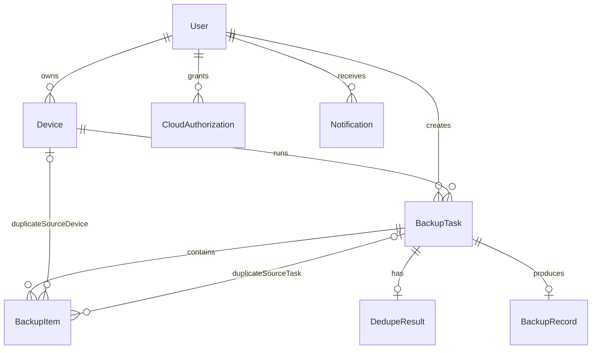

# 数据模型说明

## 1. 文档目的

本文档定义 Baidu Dedupe Backup 首期开发需要的核心数据实体、字段、关系和状态枚举。它用于指导数据库设计、接口字段设计、前后端类型定义和测试数据构造。

字段命名采用语义化英文名，具体数据库命名风格可在技术选型后统一转换。

## 2. 实体关系概览

## 3. 通用字段约定

所有需要持久化的业务实体建议包含：

| 字段 | 类型 | 说明 |
| --- | --- | --- |
| id | string | 全局唯一 ID |
| createdAt | datetime | 创建时间 |
| updatedAt | datetime | 最近更新时间 |
| deletedAt | datetime 或 null | 软删除时间，未删除为空 |

时间统一使用 UTC 存储，客户端按用户所在时区展示。

## 4. User

用户账号实体。

| 字段 | 类型 | 必填 | 说明 |
| --- | --- | --- | --- |
| id | string | 是 | 用户 ID |
| account | string | 是 | 手机号或邮箱 |
| accountType | enum | 是 | phone 或 email |
| passwordHash | string | 是 | 密码哈希 |
| status | enum | 是 | active、locked、disabled |
| lastLoginAt | datetime | 否 | 最近登录时间 |
| createdAt | datetime | 是 | 创建时间 |
| updatedAt | datetime | 是 | 更新时间 |

## 5. CloudAuthorization

百度网盘授权实体。首期 `provider` 固定为 `baidu_netdisk`。

| 字段 | 类型 | 必填 | 说明 |
| --- | --- | --- | --- |
| id | string | 是 | 授权 ID |
| userId | string | 是 | 用户 ID |
| provider | enum | 是 | baidu_netdisk |
| providerAccountName | string | 否 | 百度网盘账号昵称 |
| status | enum | 是 | unauthorized、authorized、expired、error、unbound |
| accessTokenRef | string | 否 | 授权凭据引用，不直接暴露给客户端 |
| refreshTokenRef | string | 否 | 刷新凭据引用，不直接暴露给客户端 |
| authorizedAt | datetime | 否 | 最近授权时间 |
| expiresAt | datetime | 否 | 授权失效时间 |
| totalSpaceBytes | integer | 否 | 网盘空间总量 |
| usedSpaceBytes | integer | 否 | 网盘已用空间 |
| lastCheckedAt | datetime | 否 | 最近一次空间或授权状态检查时间 |
| createdAt | datetime | 是 | 创建时间 |
| updatedAt | datetime | 是 | 更新时间 |

## 6. Device

设备实体。

| 字段 | 类型 | 必填 | 说明 |
| --- | --- | --- | --- |
| id | string | 是 | 设备 ID |
| userId | string | 是 | 用户 ID |
| localFingerprint | string | 是 | 客户端生成的设备稳定标识摘要 |
| name | string | 是 | 用户可见设备名称 |
| type | enum | 是 | desktop、laptop、external_drive、unknown |
| platform | enum | 否 | windows、macos、linux、unknown |
| status | enum | 是 | current_online、recent_online、inactive、unbound |
| firstBoundAt | datetime | 是 | 首次绑定时间 |
| lastOnlineAt | datetime | 否 | 最近在线时间 |
| lastBackupAt | datetime | 否 | 最近备份时间 |
| unboundAt | datetime | 否 | 解绑时间 |
| createdAt | datetime | 是 | 创建时间 |
| updatedAt | datetime | 是 | 更新时间 |

## 7. BackupTask

备份任务实体。

| 字段 | 类型 | 必填 | 说明 |
| --- | --- | --- | --- |
| id | string | 是 | 任务 ID |
| userId | string | 是 | 用户 ID |
| deviceId | string | 是 | 执行任务的设备 ID |
| name | string | 是 | 任务名称 |
| note | string | 否 | 任务备注 |
| status | enum | 是 | 见任务状态枚举 |
| encryptionEnabled | boolean | 是 | 是否加密 |
| dedupeEnabled | boolean | 是 | 是否开启去重 |
| cloudProvider | enum | 是 | baidu_netdisk |
| cloudTargetPath | string | 否 | 百度网盘保存位置 |
| totalItemCount | integer | 是 | 总项目数 |
| backupItemCount | integer | 是 | 需备份项目数 |
| skippedDuplicateCount | integer | 是 | 重复跳过项目数 |
| failedItemCount | integer | 是 | 异常项目数 |
| completedItemCount | integer | 是 | 已完成项目数 |
| totalBytes | integer | 否 | 原始总大小 |
| uploadedBytes | integer | 否 | 已上传大小 |
| savedBytes | integer | 否 | 预计或实际节省空间 |
| startedAt | datetime | 否 | 开始时间 |
| completedAt | datetime | 否 | 完成时间 |
| createdAt | datetime | 是 | 创建时间 |
| updatedAt | datetime | 是 | 更新时间 |
| deletedAt | datetime | 否 | 删除时间 |

## 8. BackupItem

备份项目实体。文件夹可作为用户选择项保存，同时展开后的文件也可作为可执行备份项保存。实现时可通过 `parentItemId` 表达层级。

| 字段 | 类型 | 必填 | 说明 |
| --- | --- | --- | --- |
| id | string | 是 | 项目 ID |
| taskId | string | 是 | 任务 ID |
| parentItemId | string | 否 | 父项目 ID |
| sourcePath | string | 是 | 原始本地路径，仅在用户设备或必要服务端摘要中使用 |
| displayName | string | 是 | 展示名称 |
| itemType | enum | 是 | file、folder |
| sizeBytes | integer | 否 | 大小 |
| modifiedAt | datetime | 否 | 本地修改时间 |
| fingerprint | string | 否 | 内容识别摘要 |
| status | enum | 是 | pending、need_backup、already_backed_up、duplicate_skipped、backing_up、completed、failed、skipped_by_user |
| duplicateSourceDeviceId | string | 否 | 重复来源设备 ID |
| duplicateSourceTaskId | string | 否 | 重复来源任务 ID |
| errorCode | string | 否 | 项目级错误码 |
| errorMessage | string | 否 | 项目级错误说明 |
| createdAt | datetime | 是 | 创建时间 |
| updatedAt | datetime | 是 | 更新时间 |

## 9. DedupeResult

去重分析结果实体。

| 字段 | 类型 | 必填 | 说明 |
| --- | --- | --- | --- |
| id | string | 是 | 去重结果 ID |
| taskId | string | 是 | 任务 ID |
| totalItemCount | integer | 是 | 总项目数 |
| needBackupCount | integer | 是 | 需备份项目数 |
| alreadyBackedUpCount | integer | 是 | 已备份项目数 |
| duplicateSkippedCount | integer | 是 | 重复跳过项目数 |
| pendingReviewCount | integer | 是 | 异常待确认项目数 |
| estimatedSavedBytes | integer | 是 | 预计节省空间 |
| analyzedAt | datetime | 是 | 分析时间 |
| createdAt | datetime | 是 | 创建时间 |
| updatedAt | datetime | 是 | 更新时间 |

## 10. BackupRecord

备份记录实体。

| 字段 | 类型 | 必填 | 说明 |
| --- | --- | --- | --- |
| id | string | 是 | 记录 ID |
| userId | string | 是 | 用户 ID |
| deviceId | string | 是 | 设备 ID |
| taskId | string | 是 | 任务 ID |
| status | enum | 是 | completed、failed、deleted_record |
| encryptionEnabled | boolean | 是 | 是否加密 |
| contentSummary | string | 否 | 备份内容概况 |
| cloudProvider | enum | 是 | baidu_netdisk |
| cloudTargetPath | string | 是 | 百度网盘保存位置 |
| backupItemCount | integer | 是 | 实际备份项目数 |
| skippedDuplicateCount | integer | 是 | 重复跳过项目数 |
| failedItemCount | integer | 是 | 异常项目数 |
| savedBytes | integer | 是 | 节省空间 |
| completedAt | datetime | 否 | 完成时间 |
| createdAt | datetime | 是 | 创建时间 |
| updatedAt | datetime | 是 | 更新时间 |

## 11. DedupeIndex

去重索引实体，用于跨任务和跨设备识别已备份内容。

去重索引的生成、匹配、写入时机和加密关系见 `dedupe-strategy.md`。首期最终去重判断必须基于同一用户范围内的文件内容指纹，不应使用文件名或路径作为最终判断依据。

| 字段 | 类型 | 必填 | 说明 |
| --- | --- | --- | --- |
| id | string | 是 | 索引 ID |
| userId | string | 是 | 用户 ID |
| deviceId | string | 是 | 来源设备 ID |
| taskId | string | 是 | 来源任务 ID |
| backupItemId | string | 是 | 来源项目 ID |
| fingerprint | string | 是 | 内容识别摘要 |
| displayName | string | 是 | 项目名称 |
| sizeBytes | integer | 是 | 项目大小 |
| cloudTargetPath | string | 是 | 已备份云盘位置 |
| encryptionEnabled | boolean | 是 | 来源任务是否加密 |
| createdAt | datetime | 是 | 创建时间 |
| updatedAt | datetime | 是 | 更新时间 |

同一用户下 `fingerprint` 应可被高效查询，用于去重分析。具体索引策略由数据库选型决定。推荐查询条件为 `userId + sizeBytes + fingerprint`，其中 `sizeBytes` 用于预过滤，`fingerprint` 用于最终匹配。

## 12. Notification

通知实体。

| 字段 | 类型 | 必填 | 说明 |
| --- | --- | --- | --- |
| id | string | 是 | 通知 ID |
| userId | string | 是 | 用户 ID |
| relatedTaskId | string | 否 | 关联任务 ID |
| relatedDeviceId | string | 否 | 关联设备 ID |
| type | enum | 是 | backup_completed、task_paused、task_interrupted、authorization_expired、space_insufficient、file_inaccessible、device_bind_error |
| title | string | 是 | 通知标题 |
| message | string | 是 | 通知内容 |
| status | enum | 是 | unread、read、resolved、cleared |
| createdAt | datetime | 是 | 创建时间 |
| updatedAt | datetime | 是 | 更新时间 |

## 13. 状态枚举

### 13.1 BackupTaskStatus

| 值 | 用户文案 | 说明 |
| --- | --- | --- |
| pending_start | 待开始 | 任务已创建但尚未开始 |
| preparing | 准备中 | 正在整理备份内容 |
| deduping | 对比去重中 | 正在生成去重结果 |
| backing_up | 备份中 | 正在上传或处理备份 |
| paused | 已暂停 | 用户主动暂停 |
| resuming | 恢复中 | 正在恢复任务 |
| interrupted | 异常中断 | 因断网、关机、应用关闭等中断 |
| failed | 备份失败 | 无法继续，需要用户处理 |
| completed | 已完成 | 所有需备份项目已完成 |
| deleted | 已删除 | 用户删除任务记录 |

### 13.2 BackupItemStatus

| 值 | 用户文案 | 说明 |
| --- | --- | --- |
| pending | 待处理 | 尚未分析或处理 |
| need_backup | 需备份 | 本次需要实际备份 |
| already_backed_up | 已备份 | 已在历史任务中备份过 |
| duplicate_skipped | 重复跳过 | 本次跳过重复内容 |
| backing_up | 备份中 | 正在处理 |
| completed | 已完成 | 已完成备份 |
| failed | 异常 | 处理失败 |
| skipped_by_user | 用户跳过 | 用户选择跳过 |

### 13.3 AuthorizationStatus

| 值 | 用户文案 | 说明 |
| --- | --- | --- |
| unauthorized | 未授权 | 未完成百度网盘授权 |
| authorized | 已授权 | 授权可用 |
| expired | 授权已失效 | 需要重新授权 |
| error | 授权异常 | 授权状态不可用 |
| unbound | 已解除绑定 | 用户主动解绑 |

## 14. 数据保留规则

- 删除任务记录时，`BackupTask` 可标记为 `deleted`，不默认删除 `BackupRecord` 和云盘文件。
- 解绑设备时，`Device` 标记为 `unbound`，历史任务和记录保留。
- 解除百度网盘绑定时，授权状态标记为 `unbound`，历史任务和记录保留。
- 备份完成后，去重索引保留，用于后续任务对比。
- 本地恢复点在任务完成、失败且用户确认删除后可清理。
