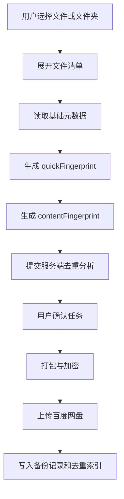

# 多设备去重技术方案

## 1. 文档目的

本文档补充 Baidu Dedupe Backup 首期“如何去重”的具体技术方案，说明文件识别、指纹生成、去重索引、跨设备匹配、加密备份关系、异常处理、性能策略和测试验收要求。

本文档面向研发、测试和后续架构评审。产品层面的去重目标见 `../spec.md`，模块边界见 `architecture.md`，字段模型见 `data-model.md`。

## 2. 设计目标

1. 在同一用户账号下识别当前设备与历史设备中已经备份过的相同内容。
2. 首期优先实现文件级去重，避免过早引入复杂的块级存储系统。
3. 去重判断尽量准确，宁可少跳过，也不能误跳过用户未备份内容。
4. 不要求用户理解哈希、分块、索引等技术概念，只展示可解释结果。
5. 去重索引不暴露文件内容，不在日志中输出敏感路径和文件内容。
6. 与默认加密备份兼容：先基于明文源文件生成去重指纹，再打包加密上传。

## 3. 首期方案结论

首期采用 **文件级内容指纹去重**：

1. 客户端扫描用户选择的文件和文件夹。
2. 对每个可读取文件生成内容指纹。
3. 服务端保存同一用户已完成备份文件的去重索引。
4. 创建新任务时，客户端提交文件摘要，服务端按用户维度匹配历史索引。
5. 命中相同内容时，该文件标记为“重复跳过”，并展示来源设备和历史任务。
6. 未命中时，该文件进入“需备份”。
7. 文件不可读取、指纹生成失败或状态不确定时，进入“异常待确认”。

首期不做块级去重、不做跨用户去重、不做相似文件去重、不做云盘文件内容反向扫描。

## 4. 去重范围

### 4.1 包含范围

- 当前用户账号下已绑定设备的历史备份项目。
- 当前用户账号下曾绑定设备的历史备份项目。
- 当前设备中此前已完成备份的项目。
- 已完成任务写入的去重索引。

### 4.2 不包含范围

- 其他用户账号的备份内容。
- 其他云盘中的文件。
- 百度网盘中非本产品创建或未写入索引的文件。
- 未完成、失败、已取消且没有成功写入索引的项目。
- 内容相似但不完全相同的文件。
- 文件夹整体结构级别的重复判断。

## 5. 去重粒度

### 5.1 文件级去重

文件级去重以单个文件内容为最小判断单位。

优点：

- 实现复杂度可控。
- 用户容易理解。
- 与任务、记录、来源设备展示天然匹配。
- 适合首期快速交付。

限制：

- 文件内只有部分内容相同时不能节省空间。
- 大文件修改少量内容后会被视为新文件。
- 无法像块级去重一样最大化节省空间。

### 5.2 文件夹处理

文件夹不直接生成“文件夹级重复”结论。客户端应展开文件夹，逐个文件生成指纹。

文件夹展示可汇总其下文件的去重结果：

- 全部文件重复：文件夹可在 UI 上显示“该文件夹内内容均已备份”。
- 部分文件重复：文件夹显示“部分内容已备份”。
- 全部文件需备份：文件夹显示“需备份”。
- 存在不可访问文件：文件夹显示“含异常项目”。

## 6. 指纹生成策略

### 6.1 指纹组成

首期建议使用两阶段指纹：

| 指纹 | 作用 | 来源 |
| --- | --- | --- |
| quickFingerprint | 快速预筛选 | 文件大小、修改时间、头尾采样哈希 |
| contentFingerprint | 最终去重判断 | 文件完整内容哈希 |

`quickFingerprint` 只能用于减少候选范围，不能单独作为跳过依据。真正判定重复必须依赖 `contentFingerprint`。

### 6.2 推荐算法

`contentFingerprint` 推荐使用 SHA-256 或 BLAKE3。

推荐优先级：

1. **BLAKE3**：速度快，适合大文件和桌面端本地扫描。
2. **SHA-256**：通用性强，生态成熟，跨语言支持好。

如果项目技术栈对 BLAKE3 支持成熟，优先使用 BLAKE3；否则使用 SHA-256。禁止使用 MD5 作为最终去重判断。

### 6.3 指纹输入

`contentFingerprint` 输入必须是文件原始内容字节流。

不应将以下内容作为最终去重依据：

- 文件名。
- 文件路径。
- 修改时间。
- 文件大小。
- 用户设备名。
- 百度网盘保存位置。

这些字段可以用于展示、排序、预筛选或异常提示，但不能替代内容指纹。

### 6.4 指纹生成时机

关键点：去重指纹必须在打包加密前生成。加密后的备份包由于密钥、随机盐或初始化向量不同，不能作为源文件重复判断依据。

## 7. 去重索引设计

### 7.1 索引写入时机

只有当文件实际成功备份并且任务结果被确认后，才写入或更新 `DedupeIndex`。

不应写入索引的情况：

- 文件读取失败。
- 文件上传失败。
- 任务被用户取消。
- 任务异常中断且该文件未完成。
- 仅完成本地打包但未成功上传。

### 7.2 索引字段

`DedupeIndex` 字段详见 `data-model.md`。去重判断必须至少依赖：

- `userId`
- `fingerprint`
- `sizeBytes`
- `backupItemId`
- `taskId`
- `deviceId`
- `cloudTargetPath`

建议查询条件：

1. 按 `userId` 限定用户范围。
2. 按 `sizeBytes` 预过滤候选。
3. 按 `fingerprint` 精确匹配。

### 7.3 索引唯一性

同一用户下，相同 `fingerprint` 可以对应多个历史来源。例如同一文件曾在多台设备中备份过。系统不应强制唯一，只需选取一个或多个来源用于解释。

推荐来源展示优先级：

1. 最近成功备份的任务。
2. 当前仍绑定设备的任务。
3. 已解绑设备的任务。

### 7.4 索引更新

文件内容发生变化后会生成新的 `contentFingerprint`，应作为新内容处理。旧索引保留，用于历史记录和旧内容匹配。

## 8. 去重分析流程

### 8.1 客户端流程

1. 用户选择文件或文件夹。
2. 客户端展开文件夹。
3. 客户端读取每个文件基础元数据。
4. 客户端对可读取文件生成 `contentFingerprint`。
5. 客户端将文件摘要提交给服务端。
6. 客户端展示服务端返回的去重结果。

客户端提交文件摘要时，应避免提交完整文件内容。

### 8.2 服务端流程

1. 校验用户登录态。
2. 校验当前设备已绑定。
3. 校验百度网盘授权状态。
4. 接收文件摘要列表。
5. 按 `userId + sizeBytes + fingerprint` 查询 `DedupeIndex`。
6. 命中索引则标记为 `duplicate_skipped` 或 `already_backed_up`。
7. 未命中索引则标记为 `need_backup`。
8. 状态不确定则标记为 `pending_review`。
9. 返回数量统计、预计节省空间和重复来源。

### 8.3 状态分类

| 分类 | 判断条件 | 后续行为 |
| --- | --- | --- |
| 需备份 | 未命中同用户历史索引 | 进入实际备份 |
| 已备份 | 命中历史索引，可展示历史存在事实 | 可合并展示为重复来源 |
| 重复跳过 | 命中历史索引，用户确认后不再上传 | 不进入实际备份 |
| 异常待确认 | 文件不可读、指纹失败或索引状态不确定 | 用户处理、跳过或重试 |

## 9. 加密备份与去重关系

### 9.1 基本原则

去重基于源文件内容指纹，不基于加密后的备份包。

原因：

- 同一文件使用不同密钥或随机参数加密后，密文通常不同。
- 加密包可能包含任务元数据、时间戳、目录结构等信息。
- 用密文判断去重会降低命中率，并把加密实现和去重索引强绑定。

### 9.2 安全边界

- 指纹是内容摘要，不能视作文件内容本身，但仍属于敏感元数据。
- 指纹只在同一用户账号范围内使用。
- 不做跨用户指纹匹配。
- 日志中不输出完整指纹，可输出截断后的前 8 位用于排查。

### 9.3 关闭加密

关闭加密不影响去重判断。无论任务是否加密，都使用同一套源文件内容指纹参与去重。

## 10. 文件变化处理

### 10.1 创建任务前变化

如果用户选择文件后，文件在指纹生成前发生变化，以最终读取时的内容为准。

### 10.2 去重分析后、备份前变化

任务开始前应重新校验需备份文件的大小、修改时间和必要指纹信息。

如果发现变化：

- 小文件可重新生成指纹并重新分析。
- 大文件可提示“文件已变化，需要重新分析后继续”。

### 10.3 备份过程中变化

备份过程中检测到文件变化时，该文件应标记为异常，不应继续上传可能不一致的内容。

用户可选择：

- 跳过该文件。
- 返回重新分析。
- 重新创建任务。

## 11. 大文件与性能策略

### 11.1 扫描进度

大文件或大文件夹生成指纹可能耗时较长，客户端应展示：

- 正在读取文件信息。
- 正在分析重复项目。
- 当前处理文件名。
- 已处理数量和总数量。

### 11.2 并发策略

客户端可并发生成多个小文件指纹，但应限制并发数，避免占满磁盘和 CPU。

建议策略：

- 小文件批量并发。
- 大文件串行或低并发。
- 用户主动暂停任务时，尽快停止后续扫描。

### 11.3 分阶段分析

对超大文件夹可采用分阶段体验：

1. 先统计文件数量和总大小。
2. 再生成指纹并展示分析进度。
3. 最后展示完整去重结果。

## 12. 隐私与日志要求

### 12.1 可提交服务端的信息

- 文件展示名。
- 文件大小。
- 文件类型。
- 修改时间。
- 内容指纹。
- 相对路径或经过脱敏处理的路径。

### 12.2 不应提交或记录的信息

- 文件内容。
- 明文敏感目录完整路径。
- 授权令牌。
- 加密密钥。
- 用户未选择目录中的文件信息。

### 12.3 日志建议

允许记录：

- 任务 ID。
- 文件数量。
- 命中索引数量。
- 跳过数量。
- 错误码。
- 指纹前 8 位。

不允许记录：

- 完整指纹批量列表。
- 文件内容。
- 真实敏感路径。

## 13. 冲突与误判处理

### 13.1 哈希冲突

SHA-256 或 BLAKE3 的实际冲突概率极低。首期可接受使用完整内容哈希作为最终判断依据。

为进一步降低风险，服务端匹配时应同时校验：

- `userId`
- `sizeBytes`
- `fingerprint`

### 13.2 指纹缺失

没有 `contentFingerprint` 的文件不能判定为重复。

处理方式：

- 标记为“异常待确认”。
- 提示用户重试或跳过。

### 13.3 来源记录缺失

如果命中指纹但来源任务或设备信息缺失，不能静默跳过。应标记为异常待确认或展示“来源记录异常，请重新分析”。

## 14. 与 API 和数据模型的对应关系

### 14.1 客户端提交

任务草稿接口中的每个文件项应包含：

- `displayName`
- `itemType`
- `sizeBytes`
- `modifiedAt`
- `fingerprint`

### 14.2 服务端返回

去重结果接口应返回：

- `needBackupCount`
- `duplicateSkippedCount`
- `pendingReviewCount`
- `estimatedSavedBytes`
- 重复来源设备。
- 重复来源任务。
- 项目级状态。

### 14.3 索引写入

任务完成接口触发服务端写入：

- `BackupRecord`
- `DedupeIndex`
- 项目级完成状态。

## 15. 测试要求

### 15.1 基础准确性

- 相同内容、不同文件名，应判定重复。
- 相同文件名、不同内容，应判定不重复。
- 相同大小、不同内容，应判定不重复。
- 不同路径、相同内容，应判定重复。

### 15.2 多设备场景

- 设备 A 完成备份后，设备 B 选择相同文件，应展示来源设备 A。
- 设备解绑后，其历史索引仍参与去重。
- 同一文件在多个设备均有历史记录时，展示最近来源。

### 15.3 加密场景

- 加密任务完成后写入源文件指纹索引。
- 未加密任务完成后写入同样格式的源文件指纹索引。
- 同一文件分别通过加密和未加密任务备份，后续任务仍能识别重复。

### 15.4 异常场景

- 文件不可访问时进入异常待确认。
- 指纹生成失败时进入异常待确认。
- 去重分析后文件变化，应提示重新分析。
- 命中索引但来源记录缺失，应进入异常待确认。

## 16. 后续演进

首期文件级去重稳定后，可评估以下增强：

1. **块级去重**：适合超大文件和少量修改场景，但需要复杂分块索引、恢复策略和存储协议。
2. **目录级摘要**：用于快速判断整个文件夹是否完全重复，但不能替代文件级判断。
3. **本地指纹缓存**：减少重复扫描同一文件的耗时，需要处理文件变化和缓存失效。
4. **更细粒度的节省空间统计**：区分历史已备份、当前任务跳过、跨设备节省等统计口径。

## 17. 首期验收标准

1. 去重判断必须基于文件内容指纹，而不是文件名或路径。
2. 同一用户多设备历史备份内容可以参与去重。
3. 用户可以查看重复项目来源设备和历史任务。
4. 默认加密任务仍可参与后续去重。
5. 文件不可访问或指纹缺失时不能误判为重复。
6. 删除任务记录不应删除已写入的历史备份记录和云盘文件说明。
7. 日志不输出文件内容、授权令牌、加密密钥或完整敏感路径。

