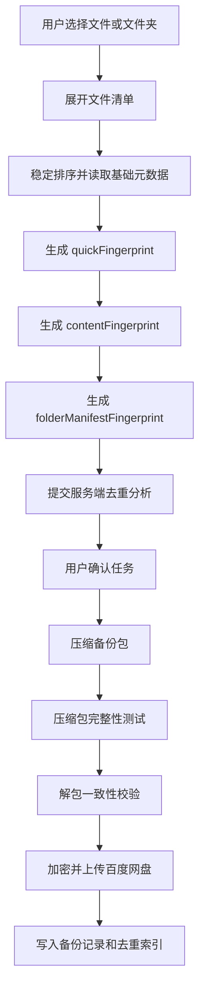

# 多设备去重技术方案

## 1. 文档目的

本文档补充 Baidu Dedupe Backup 首期“如何去重”的具体技术方案，说明文件识别、指纹生成、去重索引、跨设备匹配、加密备份关系、异常处理、性能策略和测试验收要求。

本文档面向研发、测试和后续架构评审。产品层面的去重目标见 `../spec.md`，模块边界见 `architecture.md`，字段模型见 `data-model.md`。

## 2. 设计目标

1. 在同一用户账号下识别当前设备与历史设备中已经备份过的相同内容。
2. 首期优先实现文件级去重，避免过早引入复杂的块级存储系统。
3. 去重判断尽量准确，宁可少跳过，也不能误跳过用户未备份内容。
4. 不要求用户理解哈希、分块、索引等技术概念，只展示可解释结果。
5. 去重索引不暴露文件内容，不在日志中输出敏感路径和文件内容。
6. 与默认加密备份兼容：先基于明文源文件生成去重指纹，再打包加密上传。

## 3. 首期方案结论

首期采用 **文件级内容指纹去重**：

1. 客户端扫描用户选择的文件和文件夹。
2. 对每个可读取文件生成内容派生的快速指纹和完整内容指纹。
3. 对文件夹生成确定性清单，并基于清单生成文件夹指纹，用于展示、缓存和整包校验。
4. 服务端保存同一用户已完成备份文件的去重索引。
5. 创建新任务时，客户端提交文件摘要，服务端按用户维度匹配历史索引。
6. 命中相同内容时，该文件标记为“重复跳过”，并展示来源设备和历史任务。
7. 未命中时，该文件进入“需备份”。
8. 文件不可读取、指纹生成失败或状态不确定时，进入“异常待确认”。
9. 实际备份前先压缩生成备份包，随后执行压缩包完整性测试和解包一致性校验，确认压缩包可解且解出内容与源文件清单一致后才允许上传。
10. 压缩、校验、加密和上传都必须在任务临时工作区内进行，并在每个阶段执行可用磁盘空间检查。

首期不做块级去重、不做跨用户去重、不做相似文件去重、不做云盘文件内容反向扫描。

## 4. 去重范围

### 4.1 包含范围

- 当前用户账号下已绑定设备的历史备份项目。
- 当前用户账号下曾绑定设备的历史备份项目。
- 当前设备中此前已完成备份的项目。
- 已完成任务写入的去重索引。

### 4.2 不包含范围

- 其他用户账号的备份内容。
- 其他云盘中的文件。
- 百度网盘中非本产品创建或未写入索引的文件。
- 未完成、失败、已取消且没有成功写入索引的项目。
- 内容相似但不完全相同的文件。
- 文件夹整体结构级别的重复判断。

## 5. 去重粒度

### 5.1 文件级去重

文件级去重以单个文件内容为最小判断单位。

优点：

- 实现复杂度可控。
- 用户容易理解。
- 与任务、记录、来源设备展示天然匹配。
- 适合首期快速交付。

限制：

- 文件内只有部分内容相同时不能节省空间。
- 大文件修改少量内容后会被视为新文件。
- 无法像块级去重一样最大化节省空间。

### 5.2 文件夹处理

文件夹不直接作为“跳过备份”的最小单位。客户端应展开文件夹，逐个文件生成指纹，再基于确定性清单生成文件夹指纹，用于展示、缓存、压缩包解包校验和未来目录级优化。

文件夹展示可汇总其下文件的去重结果：

- 全部文件重复：文件夹可在 UI 上显示“该文件夹内内容均已备份”。
- 部分文件重复：文件夹显示“部分内容已备份”。
- 全部文件需备份：文件夹显示“需备份”。
- 存在不可访问文件：文件夹显示“含异常项目”。

### 5.3 文件夹排序与清单规范

文件夹指纹必须基于稳定排序后的清单，避免不同操作系统、文件系统或扫描顺序导致同一文件夹得到不同摘要。

清单生成规则：

1. 将用户选择的文件夹作为根目录。
2. 递归展开所有可访问文件。
3. 为每个文件生成相对路径，路径分隔符统一为 `/`。
4. 相对路径做 Unicode NFC 规范化。
5. 排序时优先按规范化后的相对路径进行字典序升序排列。
6. 同一路径大小写冲突时，保留原始大小写用于展示，但排序比较使用规范化路径和原始路径双键，保证确定性。
7. 忽略操作系统临时文件的规则必须显式配置；首期默认不自动忽略用户选择目录内的文件。

清单条目建议包含：

```json
{
  "relativePath": "docs/report.docx",
  "sizeBytes": 123456,
  "contentFingerprint": "b3:...",
  "fileMode": "regular"
}
```

文件夹指纹计算方式：

1. 将排序后的清单序列化为规范 JSON Lines，每行一个文件条目。
2. 每行字段顺序固定为 `relativePath`、`sizeBytes`、`contentFingerprint`、`fileMode`。
3. 对 JSON Lines 字节流计算 `folderManifestFingerprint`。
4. 文件夹指纹只用于判断“目录清单是否一致”和压缩包解包校验，不作为跳过单个文件备份的唯一依据。

## 6. 指纹生成策略

### 6.1 指纹组成

成熟去重系统的共同经验是：快速匹配可以用弱校验或采样减少候选，但最终去重必须依赖强内容校验。例如 rsync 使用滚动弱校验加强校验降低传输，restic、BorgBackup 等备份系统使用内容定义切分与强摘要识别数据块。对本项目首期的文件级去重而言，`quickFingerprint` 必须来自文件内容采样，不能包含修改时间。

首期建议使用三类指纹：

| 指纹 | 作用 | 来源 |
| --- | --- | --- |
| quickFingerprint | 快速预筛选和本地缓存命中辅助 | 文件大小、固定采样窗口内容哈希 |
| contentFingerprint | 最终去重判断 | 文件完整内容哈希 |
| folderManifestFingerprint | 文件夹清单一致性判断和解包校验 | 稳定排序后的文件清单 |

`quickFingerprint` 只能用于减少候选范围，不能单独作为跳过依据。真正判定重复必须依赖 `contentFingerprint`。

### 6.2 quickFingerprint 方案

`quickFingerprint` 目标是快速排除明显不同的文件，并辅助判断本地指纹缓存是否可能复用。它不能包含修改时间，因为同一文件复制后修改时间可能变化，使用时间会导致快速指纹大量失效。

推荐格式：

```text
qf:v1:<sizeBytes>:<sampleHash>
```

采样规则：

| 文件大小 | 采样窗口 |
| --- | --- |
| 0 B | 固定空文件标记 |
| 小于等于 1 MiB | 读取完整文件，计算采样哈希 |
| 大于 1 MiB 且小于等于 64 MiB | 读取头部 256 KiB、尾部 256 KiB |
| 大于 64 MiB | 读取头部 256 KiB、中间 256 KiB、尾部 256 KiB |

`sampleHash` 使用与完整指纹相同家族的哈希算法。若完整指纹使用 BLAKE3，则采样哈希也使用 BLAKE3；若完整指纹使用 SHA-256，则采样哈希也使用 SHA-256。

`quickFingerprint` 使用规则：

- 可以用于本地缓存的候选判断。
- 可以用于向服务端预筛选候选集合。
- 不可以作为重复跳过的最终依据。
- 不可以包含修改时间、创建时间、访问时间、本地绝对路径或文件名。
- 如果 `quickFingerprint` 相同但 `contentFingerprint` 不同，必须判定为不同文件。

### 6.3 完整内容指纹方案

`contentFingerprint` 推荐使用 SHA-256 或 BLAKE3。

推荐优先级：

1. **BLAKE3**：速度快，适合大文件和桌面端本地扫描。
2. **SHA-256**：通用性强，生态成熟，跨语言支持好。

如果项目技术栈对 BLAKE3 支持成熟，优先使用 BLAKE3；否则使用 SHA-256。禁止使用 MD5 作为最终去重判断。

`contentFingerprint` 推荐格式：

```text
b3:<hex>
sha256:<hex>
```

生成规则：

1. 以流式方式读取文件原始字节。
2. 读取过程中同时统计已读字节数。
3. 读完后确认已读字节数等于扫描阶段记录的文件大小。
4. 计算完整内容哈希。
5. 如果读取过程中遇到权限、锁定、IO 错误或文件大小变化，则该文件进入异常待确认。

### 6.4 指纹输入

`contentFingerprint` 输入必须是文件原始内容字节流。

不应将以下内容作为最终去重依据：

- 文件名。
- 文件路径。
- 修改时间。
- 文件大小。
- 用户设备名。
- 百度网盘保存位置。

这些字段可以用于展示、排序、预筛选或异常提示，但不能替代内容指纹。

### 6.5 指纹生成时机



关键点：去重指纹必须在打包加密前生成。加密后的备份包由于密钥、随机盐或初始化向量不同，不能作为源文件重复判断依据。

## 7. 去重索引设计

### 7.1 索引写入时机

只有当文件实际成功备份并且任务结果被确认后，才写入或更新 `DedupeIndex`。

不应写入索引的情况：

- 文件读取失败。
- 文件上传失败。
- 任务被用户取消。
- 任务异常中断且该文件未完成。
- 仅完成本地打包但未成功上传。

### 7.2 索引字段

`DedupeIndex` 字段详见 `data-model.md`。去重判断必须至少依赖：

- `userId`
- `fingerprint`
- `sizeBytes`
- `backupItemId`
- `taskId`
- `deviceId`
- `cloudTargetPath`

建议查询条件：

1. 按 `userId` 限定用户范围。
2. 按 `sizeBytes` 预过滤候选。
3. 按 `fingerprint` 精确匹配。

### 7.3 索引唯一性

同一用户下，相同 `fingerprint` 可以对应多个历史来源。例如同一文件曾在多台设备中备份过。系统不应强制唯一，只需选取一个或多个来源用于解释。

推荐来源展示优先级：

1. 最近成功备份的任务。
2. 当前仍绑定设备的任务。
3. 已解绑设备的任务。

### 7.4 索引更新

文件内容发生变化后会生成新的 `contentFingerprint`，应作为新内容处理。旧索引保留，用于历史记录和旧内容匹配。

## 8. 去重分析流程

### 8.1 客户端流程

1. 用户选择文件或文件夹。
2. 客户端展开文件夹。
3. 客户端读取每个文件基础元数据。
4. 客户端对可读取文件生成 `contentFingerprint`。
5. 客户端将文件摘要提交给服务端。
6. 客户端展示服务端返回的去重结果。

客户端提交文件摘要时，应避免提交完整文件内容。

### 8.2 服务端流程

1. 校验用户登录态。
2. 校验当前设备已绑定。
3. 校验百度网盘授权状态。
4. 接收文件摘要列表。
5. 按 `userId + sizeBytes + fingerprint` 查询 `DedupeIndex`。
6. 命中索引则标记为 `duplicate_skipped` 或 `already_backed_up`。
7. 未命中索引则标记为 `need_backup`。
8. 状态不确定则标记为 `pending_review`。
9. 返回数量统计、预计节省空间和重复来源。

### 8.3 状态分类

| 分类 | 判断条件 | 后续行为 |
| --- | --- | --- |
| 需备份 | 未命中同用户历史索引 | 进入实际备份 |
| 已备份 | 命中历史索引，可展示历史存在事实 | 可合并展示为重复来源 |
| 重复跳过 | 命中历史索引，用户确认后不再上传 | 不进入实际备份 |
| 异常待确认 | 文件不可读、指纹失败或索引状态不确定 | 用户处理、跳过或重试 |

## 9. 加密备份与去重关系

### 9.1 基本原则

去重基于源文件内容指纹，不基于加密后的备份包。

原因：

- 同一文件使用不同密钥或随机参数加密后，密文通常不同。
- 加密包可能包含任务元数据、时间戳、目录结构等信息。
- 用密文判断去重会降低命中率，并把加密实现和去重索引强绑定。

### 9.2 安全边界

- 指纹是内容摘要，不能视作文件内容本身，但仍属于敏感元数据。
- 指纹只在同一用户账号范围内使用。
- 不做跨用户指纹匹配。
- 日志中不输出完整指纹，可输出截断后的前 8 位用于排查。

### 9.3 关闭加密

关闭加密不影响去重判断。无论任务是否加密，都使用同一套源文件内容指纹参与去重。

## 10. 压缩与解包校验

### 10.1 压缩策略

备份包必须在上传前压缩。压缩阶段的目标不仅是减少体积，也要形成可验证、可恢复、可追踪的归档单元。

压缩实现要求：

- 采用成熟压缩格式和库，不自研压缩格式。
- 压缩包应包含文件内容和恢复所需的相对路径清单。
- 压缩包内部路径必须使用文件夹清单中的规范相对路径。
- 压缩包生成时不写入会破坏可复现校验的无关随机元数据；必要元数据应进入明确 manifest。
- 压缩完成后生成 `archiveFingerprint`，用于上传前后校验压缩包字节是否变化。

### 10.2 压缩包完整性测试

压缩完成后必须先执行压缩包格式层面的完整性测试。成熟工具通常提供类似 `test archive` 的能力，例如 7-Zip 的 `t` 命令可测试压缩包完整性。

完整性测试失败时：

- 不允许进入加密或上传阶段。
- 删除失败压缩包或标记为可清理临时文件。
- 任务进入可重试异常状态。
- 用户提示“备份包生成失败，请重试”。

### 10.3 解包一致性校验

仅测试压缩包可读还不够，因为压缩包可能可解但内容不完整、路径错误或文件损坏。上传前必须执行解包一致性校验。

推荐流程：

1. 在任务临时工作区创建独立校验目录。
2. 将压缩包解压到校验目录。
3. 遍历解压结果，生成解压后文件清单。
4. 对解压后的每个文件重新计算 `contentFingerprint`。
5. 按规范路径排序生成 `extractedFolderManifestFingerprint`。
6. 比较 `extractedFolderManifestFingerprint` 与压缩前 `folderManifestFingerprint`。
7. 完全一致后，才允许进入加密和上传阶段。

校验失败时：

- 不上传该压缩包。
- 保留错误码和必要诊断信息。
- 清理校验目录。
- 提示用户重试或检查磁盘。

### 10.4 加密后校验

如果任务开启加密，加密完成后应对加密包生成 `encryptedArchiveFingerprint`。上传完成后，如果云盘适配器可返回上传对象校验信息，应与本地加密包校验信息对比；如果百度网盘能力不提供可靠校验，则至少在本地保留上传前的加密包大小和摘要，用于后续诊断。

### 10.5 校验阶段产物

| 产物 | 生成阶段 | 用途 |
| --- | --- | --- |
| folderManifestFingerprint | 压缩前 | 源文件清单基准 |
| archiveFingerprint | 压缩后 | 压缩包字节级校验 |
| extractedFolderManifestFingerprint | 解包后 | 验证解包内容与源一致 |
| encryptedArchiveFingerprint | 加密后 | 验证上传前加密包稳定性 |

## 11. 临时文件与磁盘空间策略

### 11.1 临时工作区

每个任务必须使用独立临时工作区：

```text
<app-temp>/tasks/<taskId>/
  source-manifest.jsonl
  package/
  verify-extract/
  encrypted/
  checkpoints/
```

任务完成后可清理 `package/`、`verify-extract/`、`encrypted/` 等中间产物，只保留必要 checkpoint 和诊断摘要。任务失败或异常中断时，中间产物应标记状态，下一次恢复时先判断可复用还是清理重建。

### 11.2 空间预算

压缩、解包校验、加密和上传可能同时产生大体积中间文件。任务开始前必须估算临时空间需求。

保守预算公式：

```text
requiredTempBytes =
  estimatedArchiveBytes
  + estimatedExtractBytes
  + estimatedEncryptedBytes
  + safetyMarginBytes
```

其中：

- `estimatedArchiveBytes`：压缩包预计大小。首次实现可保守按需备份原始大小估算。
- `estimatedExtractBytes`：解包校验目录预计大小，通常接近需备份原始大小。
- `estimatedEncryptedBytes`：加密包预计大小，通常接近压缩包大小加少量元数据。
- `safetyMarginBytes`：安全余量，建议取 `max(1 GiB, 需备份原始大小 * 10%)`。

如果采用“压缩包解包校验后再加密”的串行流程，可在解包校验完成并清理校验目录后再生成加密包，从而降低峰值空间。首期建议使用串行清理策略，避免同时保留过多中间文件。

### 11.3 空间检查时机

必须在以下阶段检查磁盘空间：

1. 任务开始前。
2. 压缩前。
3. 解包校验前。
4. 加密前。
5. 上传前。
6. 任务恢复前。

空间不足时：

- 任务进入 `paused` 或 `interrupted`。
- 用户提示“本地临时空间不足，请清理磁盘后继续”。
- 不应继续生成可能损坏的压缩包或加密包。

### 11.4 中间文件清理

清理规则：

- 压缩包完整性测试失败：删除该压缩包。
- 解包一致性校验成功：清理解包目录。
- 加密成功且上传完成：清理未加密压缩包和加密包，除非用户开启调试保留。
- 用户删除任务：二次确认后清理本地临时工作区。
- 应用异常退出：下次启动扫描临时工作区，按任务状态决定恢复或清理。

### 11.5 流式优化方向

后续可评估流式压缩、流式加密和分片上传，以降低中间文件体积。但即使采用流式方案，也必须保留等价的完整性校验和恢复点设计。

## 12. 文件变化处理

### 12.1 创建任务前变化

如果用户选择文件后，文件在指纹生成前发生变化，以最终读取时的内容为准。

### 12.2 去重分析后、备份前变化

任务开始前应重新校验需备份文件的大小、修改时间和必要指纹信息。

如果发现变化：

- 小文件可重新生成指纹并重新分析。
- 大文件可提示“文件已变化，需要重新分析后继续”。

### 12.3 备份过程中变化

备份过程中检测到文件变化时，该文件应标记为异常，不应继续上传可能不一致的内容。

用户可选择：

- 跳过该文件。
- 返回重新分析。
- 重新创建任务。

## 13. 大文件与性能策略

### 13.1 扫描进度

大文件或大文件夹生成指纹可能耗时较长，客户端应展示：

- 正在读取文件信息。
- 正在分析重复项目。
- 当前处理文件名。
- 已处理数量和总数量。

### 13.2 并发策略

客户端可并发生成多个小文件指纹，但应限制并发数，避免占满磁盘和 CPU。

建议策略：

- 小文件批量并发。
- 大文件串行或低并发。
- 用户主动暂停任务时，尽快停止后续扫描。

### 13.3 分阶段分析

对超大文件夹可采用分阶段体验：

1. 先统计文件数量和总大小。
2. 再生成指纹并展示分析进度。
3. 最后展示完整去重结果。

## 14. 隐私与日志要求

### 14.1 可提交服务端的信息

- 文件展示名。
- 文件大小。
- 文件类型。
- 修改时间。
- 内容指纹。
- 相对路径或经过脱敏处理的路径。

### 14.2 不应提交或记录的信息

- 文件内容。
- 明文敏感目录完整路径。
- 授权令牌。
- 加密密钥。
- 用户未选择目录中的文件信息。

### 14.3 日志建议

允许记录：

- 任务 ID。
- 文件数量。
- 命中索引数量。
- 跳过数量。
- 错误码。
- 指纹前 8 位。

不允许记录：

- 完整指纹批量列表。
- 文件内容。
- 真实敏感路径。

## 15. 冲突与误判处理

### 15.1 哈希冲突

SHA-256 或 BLAKE3 的实际冲突概率极低。首期可接受使用完整内容哈希作为最终判断依据。

为进一步降低风险，服务端匹配时应同时校验：

- `userId`
- `sizeBytes`
- `fingerprint`

### 15.2 指纹缺失

没有 `contentFingerprint` 的文件不能判定为重复。

处理方式：

- 标记为“异常待确认”。
- 提示用户重试或跳过。

### 15.3 来源记录缺失

如果命中指纹但来源任务或设备信息缺失，不能静默跳过。应标记为异常待确认或展示“来源记录异常，请重新分析”。

## 16. 与 API 和数据模型的对应关系

### 16.1 客户端提交

任务草稿接口中的每个文件项应包含：

- `displayName`
- `itemType`
- `sizeBytes`
- `modifiedAt`
- `fingerprint`

### 16.2 服务端返回

去重结果接口应返回：

- `needBackupCount`
- `duplicateSkippedCount`
- `pendingReviewCount`
- `estimatedSavedBytes`
- 重复来源设备。
- 重复来源任务。
- 项目级状态。

### 16.3 索引写入

任务完成接口触发服务端写入：

- `BackupRecord`
- `DedupeIndex`
- 项目级完成状态。

## 17. 测试要求

### 17.1 基础准确性

- 相同内容、不同文件名，应判定重复。
- 相同文件名、不同内容，应判定不重复。
- 相同大小、不同内容，应判定不重复。
- 不同路径、相同内容，应判定重复。
- 相同内容、不同修改时间，应判定重复。
- `quickFingerprint` 相同但 `contentFingerprint` 不同时，应判定不重复。

### 17.2 文件夹场景

- 同一文件夹在不同扫描顺序下应生成相同 `folderManifestFingerprint`。
- 文件夹内相同文件集合但相对路径不同，应生成不同 `folderManifestFingerprint`。
- 文件夹解包后的 `extractedFolderManifestFingerprint` 必须与压缩前 `folderManifestFingerprint` 一致。

### 17.3 多设备场景

- 设备 A 完成备份后，设备 B 选择相同文件，应展示来源设备 A。
- 设备解绑后，其历史索引仍参与去重。
- 同一文件在多个设备均有历史记录时，展示最近来源。

### 17.4 加密场景

- 加密任务完成后写入源文件指纹索引。
- 未加密任务完成后写入同样格式的源文件指纹索引。
- 同一文件分别通过加密和未加密任务备份，后续任务仍能识别重复。

### 17.5 压缩与磁盘场景

- 压缩包完整性测试失败时，不允许上传。
- 解包内容与源清单不一致时，不允许上传。
- 本地临时空间不足时，任务应暂停或中断并提示用户清理磁盘。
- 解包校验成功后，应清理解包目录以释放空间。

### 17.6 异常场景

- 文件不可访问时进入异常待确认。
- 指纹生成失败时进入异常待确认。
- 去重分析后文件变化，应提示重新分析。
- 命中索引但来源记录缺失，应进入异常待确认。

## 18. 后续演进

首期文件级去重稳定后，可评估以下增强：

1. **块级去重**：适合超大文件和少量修改场景，但需要复杂分块索引、恢复策略和存储协议。
2. **目录级摘要**：用于快速判断整个文件夹是否完全重复，但不能替代文件级判断。
3. **本地指纹缓存**：减少重复扫描同一文件的耗时，需要处理文件变化和缓存失效。
4. **更细粒度的节省空间统计**：区分历史已备份、当前任务跳过、跨设备节省等统计口径。
5. **流式压缩加密上传**：减少中间文件峰值占用，但必须保留等价完整性校验能力。

## 19. 首期验收标准

1. 去重判断必须基于文件内容指纹，而不是文件名或路径。
2. 同一用户多设备历史备份内容可以参与去重。
3. 用户可以查看重复项目来源设备和历史任务。
4. 默认加密任务仍可参与后续去重。
5. 文件不可访问或指纹缺失时不能误判为重复。
6. 删除任务记录不应删除已写入的历史备份记录和云盘文件说明。
7. 日志不输出文件内容、授权令牌、加密密钥或完整敏感路径。
8. `quickFingerprint` 不包含修改时间，复制导致时间变化不应影响重复识别。
9. 文件夹指纹基于稳定排序清单生成，同一目录内容在不同扫描顺序下结果一致。
10. 压缩包上传前必须通过完整性测试和解包一致性校验。
11. 压缩、解包校验、加密和上传前必须检查本地临时空间。

## 20. 技术参考

本方案借鉴以下成熟系统和论文的设计原则：

1. [rsync algorithm technical report](https://rsync.samba.org/tech_report/tech_report.html)：使用快速滚动校验定位候选，再用更强校验确认内容一致；本方案借鉴“快速校验只做候选筛选，最终判断依赖强校验”的思想。
2. [restic repository design](https://restic.readthedocs.io/en/stable/100_references.html)：使用内容哈希作为存储对象 ID，并通过内容哈希校验存储对象；本方案借鉴“内容摘要用于识别和完整性验证”的思想。
3. [BorgBackup internals](https://borgbackup.readthedocs.io/en/stable/internals/data-structures.html)：使用内容定义切分和强摘要作为去重标准，并将文件缓存中的时间信息用于缓存判断而非最终去重身份；本方案借鉴“缓存条件与去重身份分离”的思想。
4. [FastCDC paper](https://www.usenix.org/conference/atc16/technical-sessions/presentation/xia)：说明内容定义切分在去重系统中的成熟应用和性能优化方向；本项目首期暂不实现块级 CDC，但将其列为后续演进方向。
5. [7-Zip test command](https://7zip.bugaco.com/7zip/MANUAL/cmdline/commands/test.htm)：成熟压缩工具提供压缩包测试能力；本方案要求上传前执行压缩包完整性测试，并进一步执行解包一致性校验。
