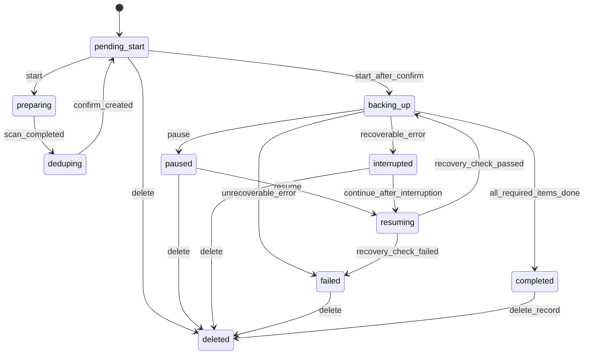

# 状态机与错误码

## 1. 文档目的

本文档定义 Baidu Dedupe Backup 首期开发所需的任务状态机、操作权限、错误码和用户提示规则。它用于保证客户端、服务端、测试和文案对同一状态有一致理解。

## 2. 任务状态机

## 3. 状态定义

| 状态值 | 用户文案 | 定义 |
| --- | --- | --- |
| pending_start | 待开始 | 任务已创建，等待用户开始 |
| preparing | 准备中 | 正在读取和整理备份内容 |
| deduping | 对比去重中 | 正在分析重复项目 |
| backing_up | 备份中 | 正在打包、加密或上传 |
| paused | 已暂停 | 用户主动暂停 |
| resuming | 恢复中 | 正在恢复任务并检查前置条件 |
| interrupted | 异常中断 | 任务因可恢复异常中断 |
| failed | 备份失败 | 任务无法继续，需要用户处理或重建 |
| completed | 已完成 | 所有需备份项目已完成 |
| deleted | 已删除 | 用户删除任务记录 |

## 4. 状态可用操作

| 当前状态 | 开始 | 暂停 | 恢复 | 继续备份 | 删除 | 查看详情 |
| --- | --- | --- | --- | --- | --- | --- |
| pending_start | 可用 | 不可用 | 不可用 | 不可用 | 可用 | 可用 |
| preparing | 不可用 | 可用 | 不可用 | 不可用 | 二次确认 | 可用 |
| deduping | 不可用 | 可用 | 不可用 | 不可用 | 二次确认 | 可用 |
| backing_up | 不可用 | 可用 | 不可用 | 不可用 | 二次确认 | 可用 |
| paused | 不可用 | 不可用 | 可用 | 不可用 | 可用 | 可用 |
| resuming | 不可用 | 可用 | 不可用 | 不可用 | 二次确认 | 可用 |
| interrupted | 不可用 | 不可用 | 不可用 | 可用 | 可用 | 可用 |
| failed | 不可用 | 不可用 | 按原因决定 | 按原因决定 | 可用 | 可用 |
| completed | 不可用 | 不可用 | 不可用 | 不可用 | 可用 | 可用 |
| deleted | 不可用 | 不可用 | 不可用 | 不可用 | 不可用 | 可用 |

## 5. 错误码分类

错误码采用大类前缀：

- `AUTH_*`：账号和登录错误。
- `CLOUD_*`：百度网盘授权和云盘错误。
- `DEVICE_*`：设备绑定和设备状态错误。
- `TASK_*`：任务状态和操作错误。
- `FILE_*`：本地文件访问错误。
- `BACKUP_*`：打包、加密、上传和恢复错误。
- `NETWORK_*`：网络错误。
- `SYSTEM_*`：系统或未知错误。

## 6. 错误码清单

### 6.1 账号错误

| 错误码 | 用户提示 | 建议操作 |
| --- | --- | --- |
| AUTH_REQUIRED | 请先登录后再继续使用。 | 前往登录 |
| SESSION_EXPIRED | 登录状态已过期，请重新登录。 | 重新登录 |
| ACCOUNT_NOT_FOUND | 账号不存在，请检查后重试。 | 检查账号或注册 |
| PASSWORD_INCORRECT | 密码错误，请重新输入。 | 重新输入密码 |
| ACCOUNT_LOCKED | 账号暂时受限，请稍后再试。 | 稍后重试 |
| VERIFICATION_CODE_INVALID | 验证码错误或已过期。 | 重新获取验证码 |

### 6.2 百度网盘错误

| 错误码 | 用户提示 | 建议操作 |
| --- | --- | --- |
| CLOUD_NOT_AUTHORIZED | 当前还没有授权百度网盘。 | 完成授权 |
| CLOUD_AUTH_EXPIRED | 百度网盘授权已失效。 | 重新授权 |
| CLOUD_AUTH_FAILED | 百度网盘授权失败。 | 重试授权 |
| CLOUD_UNBOUND | 百度网盘已解除绑定。 | 重新授权 |
| CLOUD_SPACE_INSUFFICIENT | 百度网盘空间不足，当前任务已暂停。 | 清理空间后继续 |
| CLOUD_UPLOAD_FAILED | 上传到百度网盘失败。 | 检查网络后重试 |
| CLOUD_RATE_LIMITED | 百度网盘暂时繁忙。 | 稍后继续 |

### 6.3 设备错误

| 错误码 | 用户提示 | 建议操作 |
| --- | --- | --- |
| DEVICE_NOT_BOUND | 当前设备尚未绑定。 | 绑定当前设备 |
| DEVICE_UNBOUND | 当前设备已解绑。 | 重新绑定 |
| DEVICE_BIND_FAILED | 设备绑定失败。 | 重试绑定 |
| DEVICE_NOT_FOUND | 未找到该设备。 | 刷新设备列表 |

### 6.4 任务错误

| 错误码 | 用户提示 | 建议操作 |
| --- | --- | --- |
| TASK_NOT_FOUND | 未找到该备份任务。 | 刷新任务列表 |
| TASK_STATE_CONFLICT | 当前任务状态不支持该操作。 | 刷新后重试 |
| TASK_DELETE_CONFIRM_REQUIRED | 删除任务前需要确认。 | 阅读提示并确认 |
| TASK_INTERRUPTED | 上次备份未正常完成。 | 继续备份 |
| TASK_RECOVERY_FAILED | 任务恢复失败。 | 查看原因后处理 |
| TASK_ALREADY_COMPLETED | 任务已完成。 | 查看结果 |

### 6.5 文件错误

| 错误码 | 用户提示 | 建议操作 |
| --- | --- | --- |
| FILE_NOT_FOUND | 部分文件不存在。 | 重新选择或跳过 |
| FILE_PERMISSION_DENIED | 部分文件无权限访问。 | 修改权限或跳过 |
| FILE_CHANGED | 部分文件已发生变化。 | 重新分析后继续 |
| FILE_READ_FAILED | 文件读取失败。 | 重试或跳过 |

### 6.6 备份执行错误

| 错误码 | 用户提示 | 建议操作 |
| --- | --- | --- |
| BACKUP_PACKAGE_FAILED | 备份包生成失败。 | 重试任务 |
| BACKUP_ENCRYPTION_FAILED | 加密备份失败。 | 重试任务 |
| BACKUP_CHECKPOINT_MISSING | 未找到可恢复的进度。 | 重新开始任务 |
| BACKUP_RESUME_CONFLICT | 本地文件变化较大，无法直接继续。 | 返回处理或重新创建 |

### 6.7 网络和系统错误

| 错误码 | 用户提示 | 建议操作 |
| --- | --- | --- |
| NETWORK_UNAVAILABLE | 网络连接异常，备份已暂停。 | 检查网络后继续 |
| NETWORK_TIMEOUT | 网络请求超时。 | 稍后重试 |
| SYSTEM_UNKNOWN | 发生未知错误。 | 重试或联系支持 |

## 7. 错误处理规则

1. 可恢复错误优先转为 `interrupted` 或 `paused`。
2. 授权失效需要引导重新授权，不应让用户反复点击继续。
3. 空间不足时优先暂停任务，并提示清理空间。
4. 文件不可访问应允许用户跳过或重新选择。
5. 删除任务必须使用二次确认，不允许静默删除。
6. 错误提示必须包含发生了什么、为什么可能发生、下一步怎么做。

## 8. 用户提示模板

### 8.1 异常中断恢复

上次备份未正常完成。你可以继续备份，已完成的内容不会重复处理。

### 8.2 空间不足

百度网盘空间不足，当前任务已暂停。请清理空间后继续备份。

### 8.3 文件不可访问

部分文件当前无法读取。你可以检查文件权限后重试，也可以跳过这些文件继续备份。

### 8.4 授权失效

百度网盘授权已失效。重新授权后，你可以继续未完成的备份任务。

### 8.5 删除任务

删除后，该任务将不再显示在任务列表中。已完成上传到百度网盘的备份文件不会自动删除。

